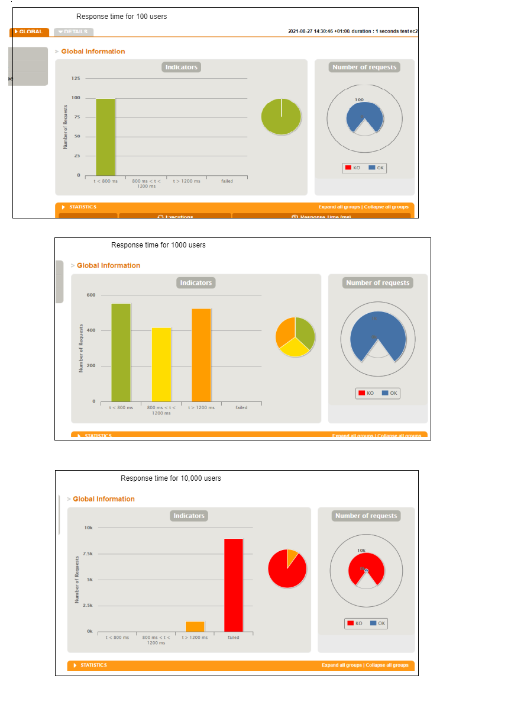

# Gatling Testing of the JobCentre++ application
## This testing framework was designed to test the JobCentre++ application running on http://54.194.182.114:5000/ (AWS ec2 instance)

## To test it out, simply execute the following command:

`mvn gatling:test -Dgatling.simulationClass=simulations.JobcentreSimulation`

## Some of the sample reports can be seen below:
